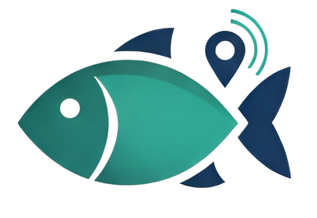

# FishBack - Trazabilidad marina

## Descripción del Proyecto
FishBack es una plataforma que ayuda a la trazabilidad marina en organizar y reportar la pesca mediante un sistema sencillo y eficiente.

## Autores
- Huingo Tello, Frank Anthony 
- Wang Chen, Juan Sung Jau 
- Espinoza Huamani Digber David 
- Rodriguez Espinosa Andre Iosef 
- Payano Puchuri, Joan Fabricio 

## Segmento Objetivo
- Pescadores
- Vendedores de pescado

## Características Principales
- Acceso rápido y jerárquico a las funciones principales.
- Flujos secuenciales guiados para reducir errores.
- Filtros inteligentes y categorización múltiple de datos.
- Diseño responsivo y accesible en cualquier dispositivo.
- Promueve la sostenibilidad y la transparencia en la pesca.

## Tecnologías Utilizadas
- HTML5
- CSS3
- JavaScript
